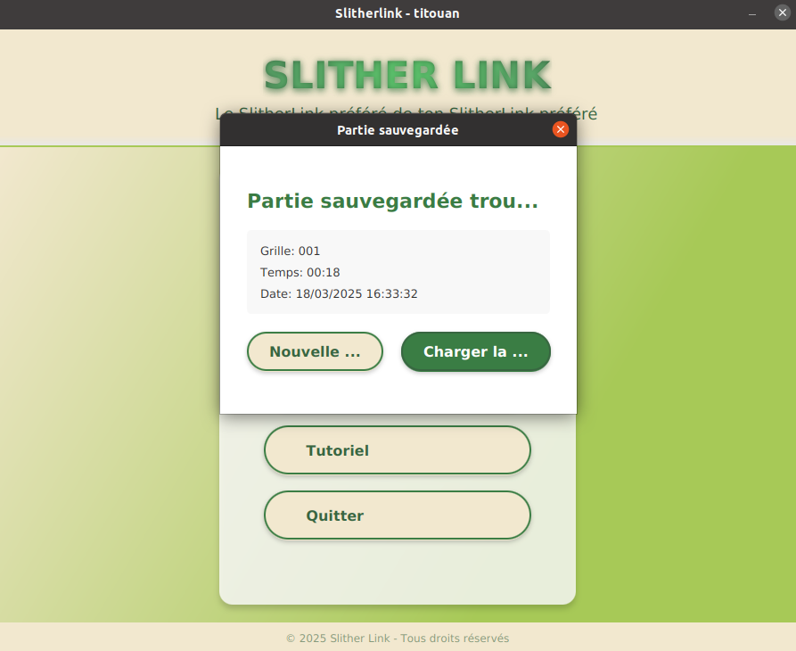
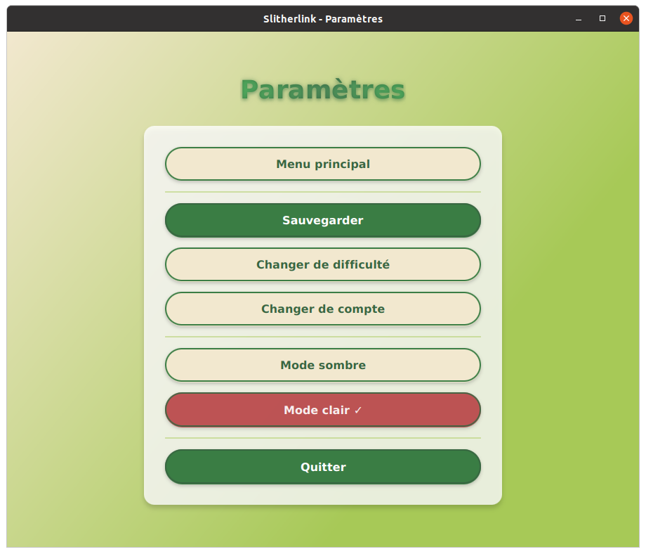
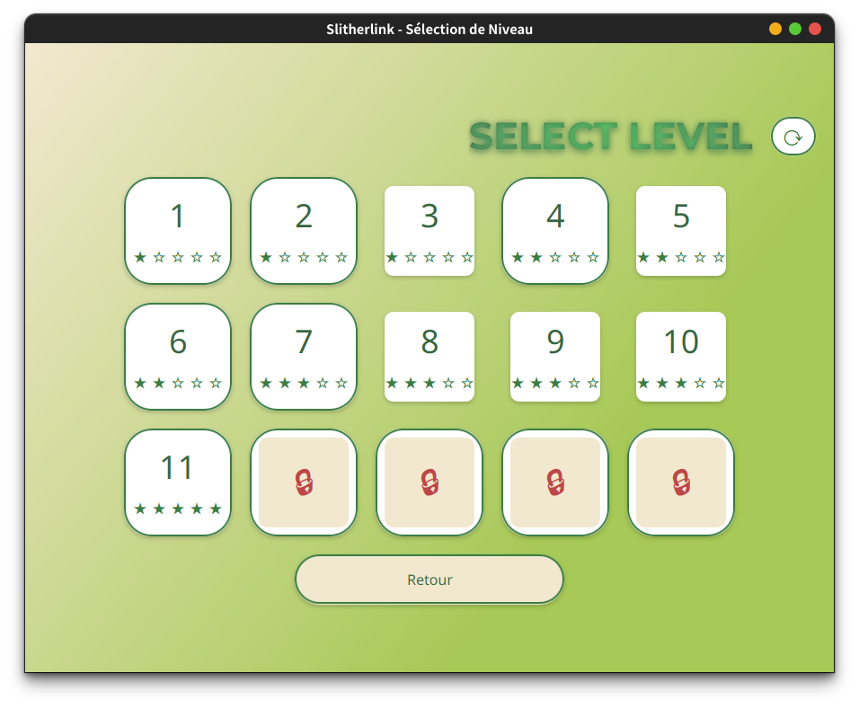
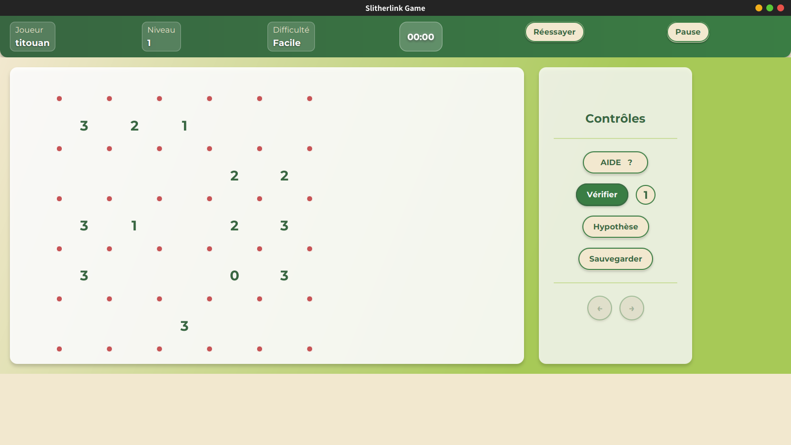

# Manuel Utilisateur SlitherLink

## Table des matières

- [Introduction](#introduction)
- [Se connecter / Charger une partie](#Se-connecter-/-Charger-une-partie)
- [Chapitre 2](#chapitre-2)
- [Conclusion](#conclusion)

## Introduction
Lorem ipsum...

## Se connecter / Charger une partie
Lorseque vous ouvrez le jeu, vous arrivez sur l'interface ci-dessous : 

Dans ce champ vous devez entrer votre pseudo, si vous avez déjà fait des parties avec ce dernier le jeu vous reconnaitera et vous arriverez sur l'écran ci dessous. SI ce n'est pas le cas, alors le jeu vous créera un compte (en local).

Ici vous pourrez donc choisir de continuer la partie que vous faisiez la dernière fois, ou en commencer une nouvelle. Si vous choisissez "nouvelle partie", vous arriverez sur le menu d'accueil.

## Menu d'accueil

Le menu d'accueil est la page principale, celle sur laquelle vous arrivez lorsque vous lancez le jeu. Avec les cinq bouttons présents, vous pouvez effectuer les actions suivantes : 

 - Lancer le mode aventure
 - Lancer le mode libre
 - Changer les parametres
 - Lancer le tutoriel
 - Quitter L'application

 Si vous voulez changer les parametres vous arriverez sur l'écran suivant : 

Et vous pourrez alors 

- Sauvegarder votre progression
- Changer la difficulté
- Changer de compte
- Passer du mode sombre au mode clair

## Jouer une partie 

Après avoir cliqué sur `Mode Aventure` vous arrivez ensuite sur l'écran suivant ou vous pouvez choisir le niveau que vous boulez lancer (les niveaux bloqués sont débloqués en réalisant les niveaux précédents) : 

Une fois le nveau lancé vous arrivez sur l'interface ,principale d'une partie de slitherlink : 

## Conclusion
Lorem ipsum...

