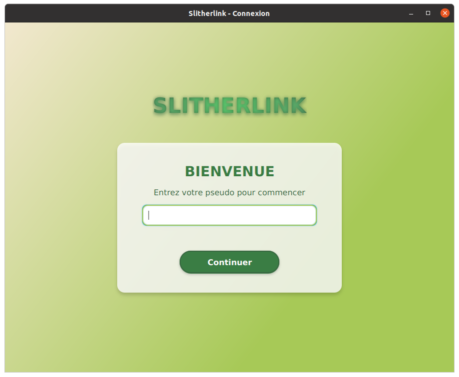

# Manuel Utilisateur SlitherLink

## Table des matières

- [Introduction](#introduction)
- [Se connecter / Charger une partie](#Se-connecter-/-Charger-une-partie)
- [Chapitre 2](#chapitre-2)
- [Conclusion](#conclusion)

## Introduction
Lorem ipsum...

## Se connecter / Charger une partie
Lorseque vous ouvrez le jeu, vous arrivez sur l'interface ci-dessous : 

## Chapitre 2
Lorem ipsum...

## Conclusion
Lorem ipsum...

